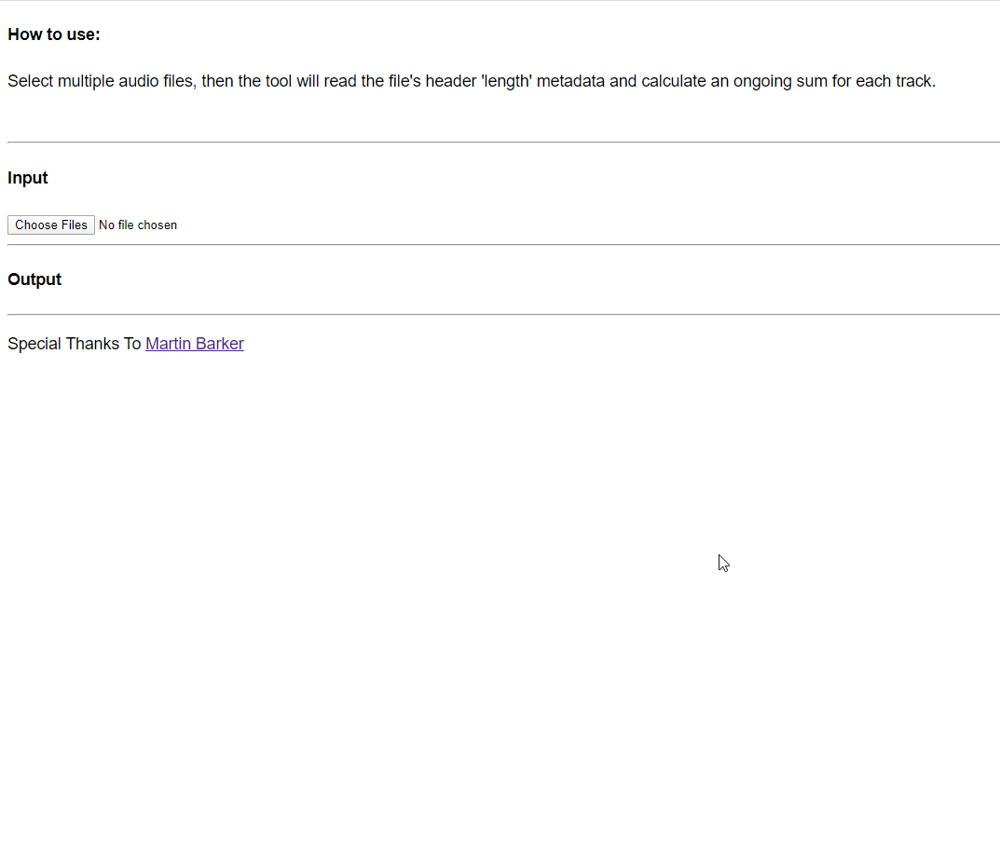

# Timestamp Generator

A website which calculates an album's tracklist and timestamps from uploaded user files, and prints the results in a user-friendly readable format like such:

Tracklist:

```text
    (00:00) 01 - Sunrise
    (05:44) 02 - Plateau
    (10:21) 03 - Savannah
    (14:55) 04 - Canyon
    (20:26) 05 - Orange Valley
    (25:28) 06 - Sand-Dunes
    (28:35) 08 - Swamps
```

## Usage



## Live at

👉 [Timestamp Generator](https://tl.upbooo.com) 👈

## Credit

🙏 Special thanks to [Martin Barker](https://github.com/MartinBarker) 🙏
